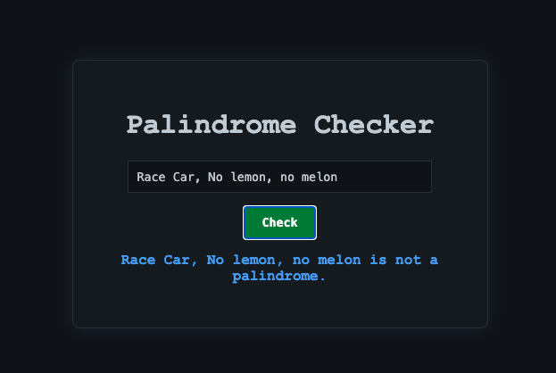

# Palindrome Checker ⭐️

A **Palindrome Checker** is a simple app that lets users test whether a given word, phrase, or sentence reads the same forwards and backwards — ignoring spaces, punctuation, and capitalization.

---

### Tech Stack

- **HTML** – structure of the page
- **CSS** – styled with a console-inspired dark theme
- **JavaScript** – handles input checking and palindrome logic

I used vanilla JS (no frameworks) to keep the project lightweight.

---

### Result

---

### How to Use

1. Enter any word or phrase. e.g. eye, civil, lemon...
2. Click the **Check** button.
3. The app will tell you if it’s a palindrome!
